# InvestiMaker Phase 1-C-1 ワイヤーフレームと操作判断

作成日：2026-10-05
基準：`InvestiMaker_Phase1C_UIUX_Design.md`（UI/UX 設計書 v0.1）

設計書 v0.1 を基に、メイン画面のワイヤーフレームを作り、レイアウト 3 案を比べた。あわせて、設計書だけでは決まらない操作上の判断を洗い出し、それぞれに推奨を付けた。

> **Phase 1-C-1 は完了。** レイアウトは案 B、操作判断 1〜31 は記載の推奨のとおりに**確定**した（§0）。以下の本文で「推奨」とあるものは、すべて採用された内容である。

## 0. 確定事項（2026-10-05）

| 項目 | 決定 |
| --- | --- |
| レイアウト | **案 B。** 左端が「何を編集するか」、その隣が「何を選ぶか」、中央が「結果」、右が「選んだものの調整」。左ペインの幅（約 420 px）は仕様にしない。**画面の幅が 1280 px 程度を下回ったら Part の一覧を折り畳める**ことを将来の要件として残す |
| PNG 出力の場所 | **EXPORT の段。** ヘッダーは「キャラクターのデータそのものの操作（保存・読込・設定）」、EXPORT は「完成物を外へ出す操作」 |
| 表情のプリセット | **Phase 1-C から出す**（標準表情 6 種）。保存するのは目・眉・口の状態だけで、Character Schema に概念を足さない。**ポーズのプリセットはまだ出さない** |
| `pivot` | **UI の既定を「パーツの中心」にする。** その Part について現在描画の対象になっている Layer 群の、**透明でない画素の外接矩形の中心**とする（キャンバスの中心や、トリミング前の画像の中心ではない）。UI が求めた座標を Character の `pivot` として明示的に保存する。Asset 仕様の既定値（キャンバス中央）は変えない |
| 表示名 | **UI 側の辞書**で持つ。Asset 仕様には表示名を足さない（将来の多言語化もここで扱う） |
| なくせない分類 | **UI 側の定義**とする |
| 向き（VIEW） | **「ポーズ・向き」の大分類の中**に置く |
| 操作判断 1〜31 | **§4 に記載の推奨のとおり採用** |
| 素体の扱い | 素体を選ぶと右ペインに全体の色と体型が出る、という Phase 1-C の形でよい。**素体が増えても、性別や年齢を Character の属性として先に選ばせない。** あくまで素体を選んだ結果として見た目が決まる構造を保つ |

次は Phase 1-C-2（Creator UI の実装）。ワイヤーフレームはこれ以上増やさない。

- ワイヤーフレームの本体：[wireframes/phase1c-wireframes.html](wireframes/phase1c-wireframes.html)（ブラウザで開ける。外部の資源は読み込まない）
- 画像：[wireframes/images/](wireframes/images/)（`npm run wireframes` で作り直せる）

配置と操作の位置を比べるためのもので、色・書体・余白は仮である。サムネイルとプレビューには仮素材の画像を使っている。Asset 仕様と Character Schema（どちらも RC1）は変えていない。

## 1. レイアウトの比較

設計書 §3 は 3 ペイン構成を定めているが、**Part の一覧（サムネイルの並び）をどこに置くか**は書かれていない。ここが画面の使い勝手を最も左右するので、3 案を同じ状態（髪 → 前髪を選んでいるところ）で比べた。

### 案 A：左はカテゴリだけ、Part の一覧は右ペインの上

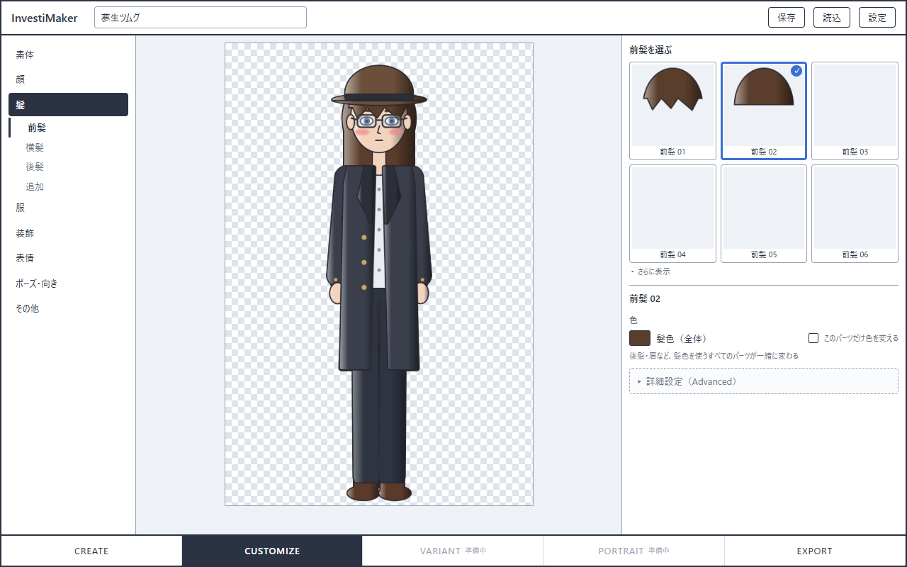

### 案 B：左で選ぶ（大分類の列 ＋ 一覧）、右は編集だけ

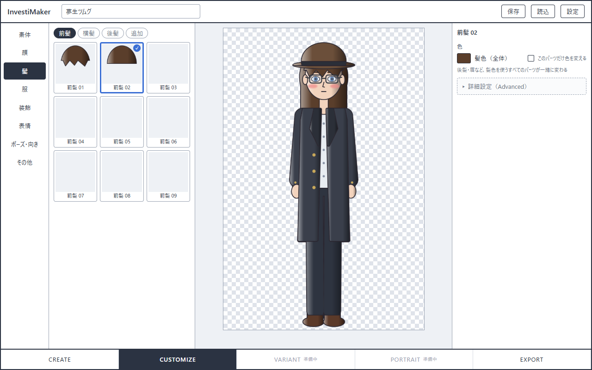

### 案 C：左はカテゴリ、Part の一覧はプレビューの下に横並び

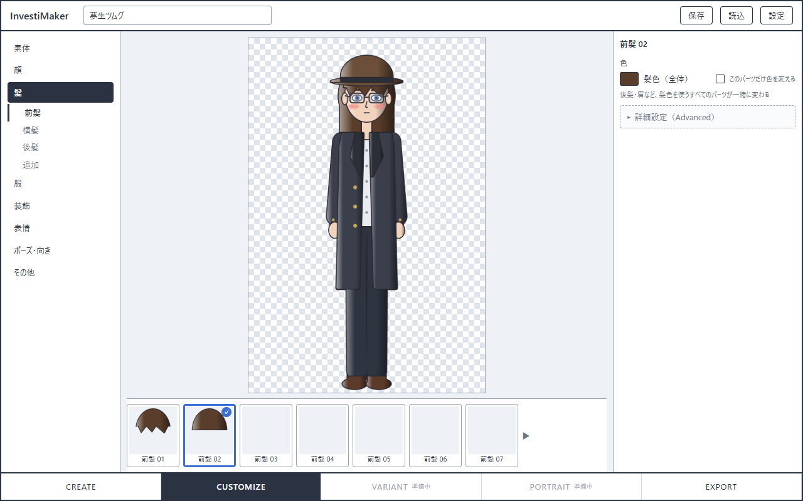

### 比較

| 観点 | 案 A | 案 B | 案 C |
| --- | --- | --- | --- |
| 設計書 §3 の図との近さ | 最も近い | 左ペインが 2 列になる | 近い |
| 「選ぶ」と「調整する」の分かれ方 | どちらも右ペイン。一覧が長いと色の設定が下に押し出される | **左で選び、右で調整する**、に分かれる | 分かれるが、選ぶ場所が下、分類が左と離れる |
| 一度に見える Part の数（1280×800） | 6 個（「さらに表示」で展開） | **9 個以上**（縦に続けて並べられる） | 7 個（横に送る） |
| プレビューの大きさ | 最大 | 幅は最も狭いが、高さは A と同じ | **帯の分だけ小さくなる**（絵が縦長のため） |
| 分類から Part までの視線の移動 | 左端 → 右端 | **隣どうし** | 左 → 下 |
| 表情・ポーズなど Part でないものの置き場所 | 右ペインに選択肢と設定が混ざる | 左の一覧の位置にプリセットや選択肢を置ける | 下の帯に収まりにくい |
| 素材が増えたとき（検索・タグ） | 右ペインがさらに混む | 一覧の列の上に置ける | 帯の上に置くと、プレビューがさらに小さくなる |

### 推奨：案 B

（確定：案 B）理由は 3 つある。

1. **役割が左右で分かれる。** 設計書 §3 の「左側を『ユーザーが選ぶカテゴリ』、右側を『選択対象の編集』に再構成する」を、Part の一覧まで含めて素直に実現できる。右ペインは「いま選んでいるものの設定」だけになり、設計書 §8 の「常に全設定を並べない」とも合う。
2. **最も頻繁な操作が最短になる。** 分類を選んで Part を選ぶ、という繰り返しが、隣り合った 2 列の中で完結する。
3. **プレビューを削らない。** 立ち絵は縦長（2:3）なので、横幅を譲っても絵の大きさは変わらない。案 C のように高さを譲ると、絵そのものが小さくなる。

案 B の弱点は、左ペインが広く（約 420 px）、狭い画面で窮屈になることである。デスクトップが主対象なので Phase 1-C では受け入れ、スマートフォン向けの配置は設計書 §18 のとおり後で考える。

以降のワイヤーフレームは案 B で描いている。

## 2. 操作の流れ（案 B）

### 流れ 1：CREATE

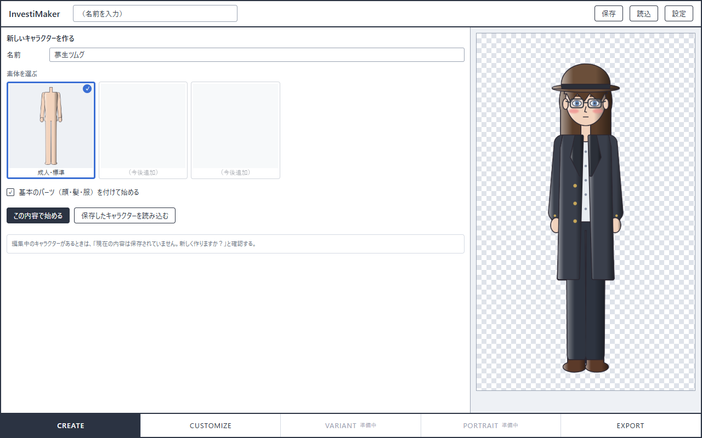

名前と素体を決めて始める。「基本のパーツを付けて始める」を外すと、素体だけで始まる。

### 流れ 2：服を選び、色を変える

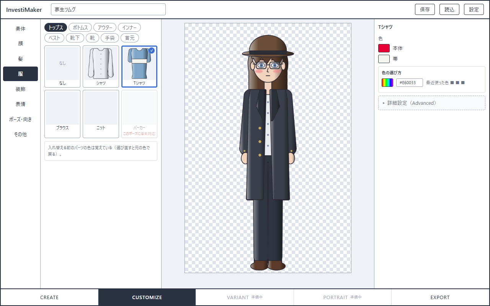

カードを選ぶと装備され、同時に右ペインの編集対象になる。1 つだけ選べる分類では入れ替わり、先頭の「なし」で外す。

### 流れ 3：全体の色と、パーツだけの色

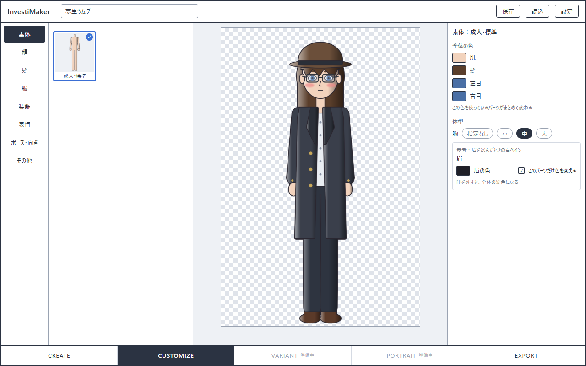

素体を選ぶと、肌・髪・瞳の「全体の色」と体型を編集できる。髪や眉のパーツ側では「このパーツだけ色を変える」で切り離す。

### 流れ 4：表情

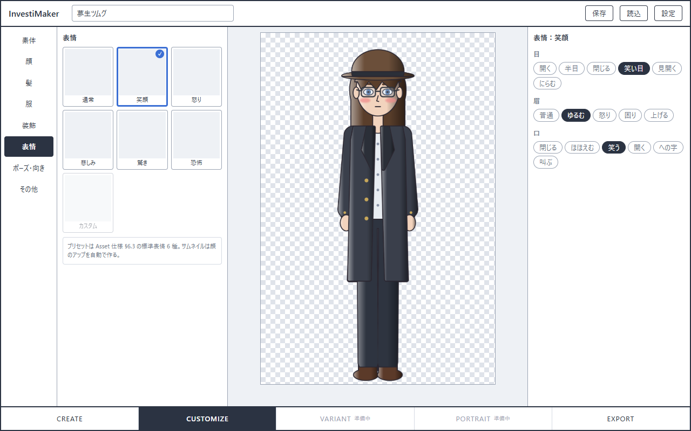

左でプリセットを選び、右で目・眉・口を個別に変える。

### 流れ 5：ポーズと向き

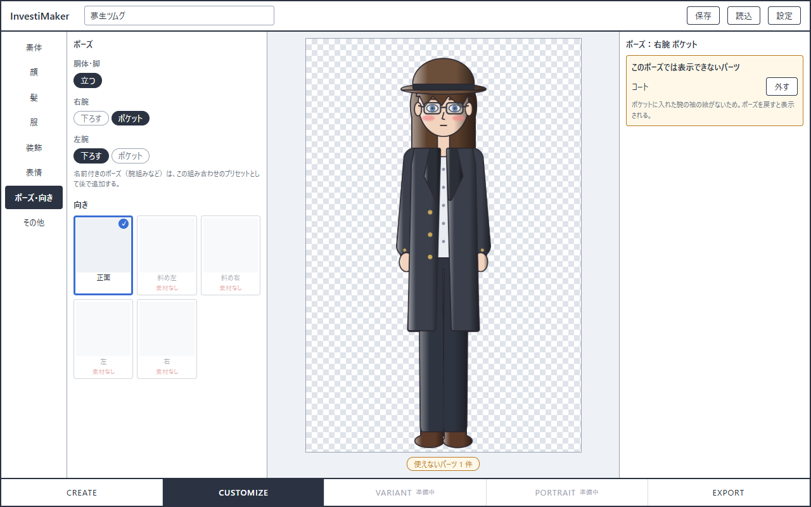

ポーズは領域ごとに選ぶ。向きは同じ大分類に置き、素材のない向きは選べない。

### 流れ 6：詳細設定（Advanced）

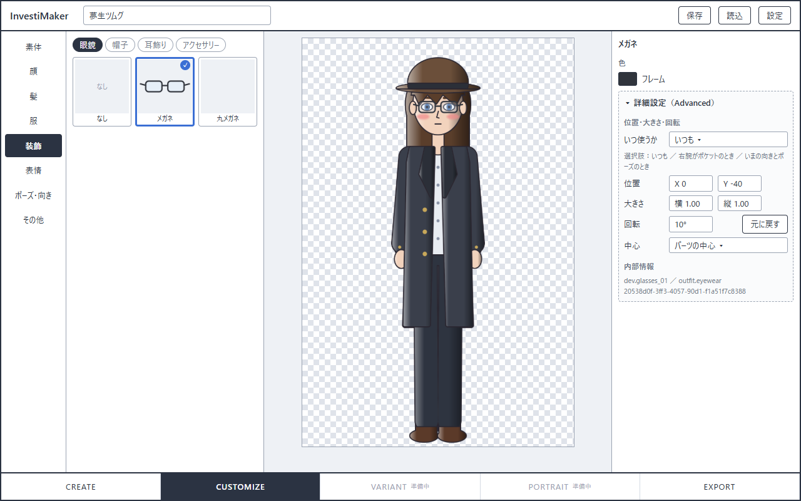

右ペインの下に、選択中のパーツの配置補正を開く。内部の ID はここでだけ見える。

### 流れ 7：見つからない素材があるとき

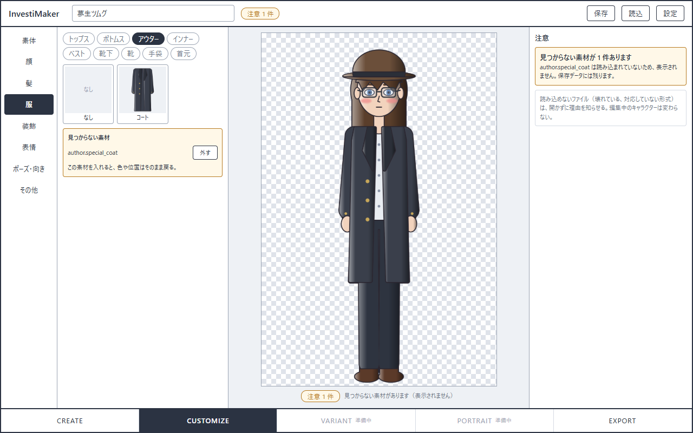

問題があるときだけ印を出す。編集・保存・PNG 出力はそのままできる。

### 流れ 8・9：EXPORT

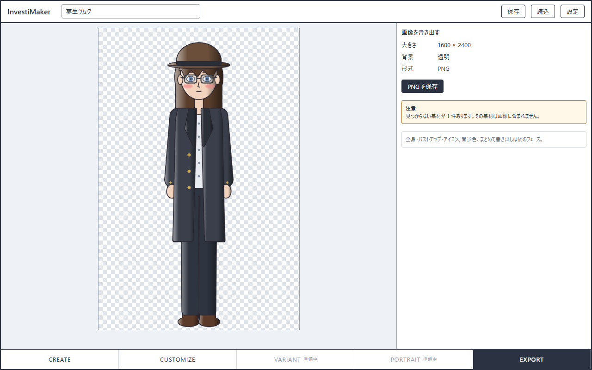

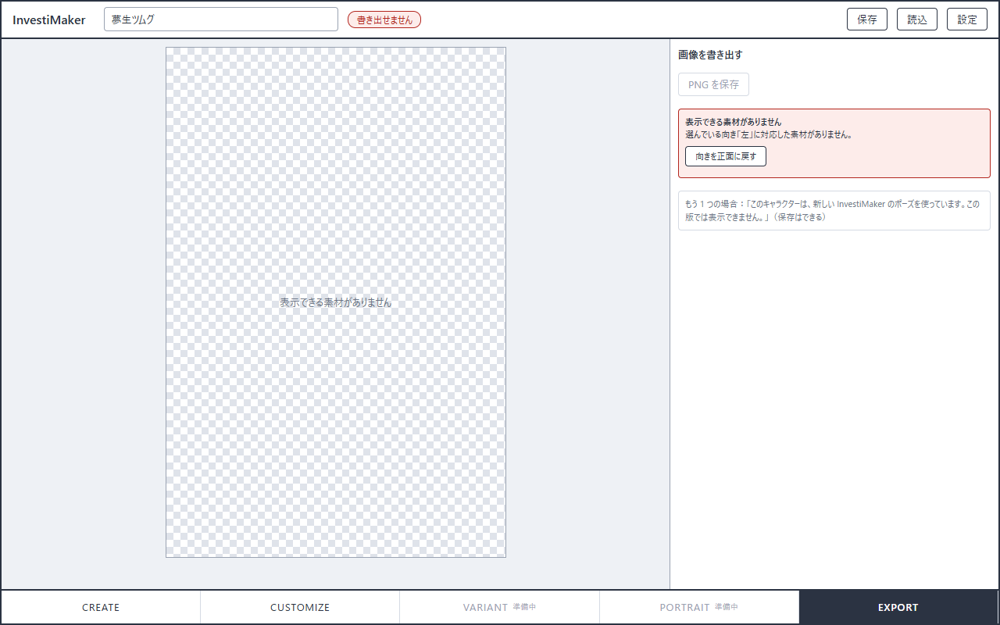

Phase 1-C の EXPORT は 1 枚の PNG だけ。書き出せないときは、理由と直し方を示す。

## 3. 分類の構成

設計書 §5 の大分類に、Asset 仕様 §2 の category を割り当てた。利用者に見せるのは左 2 列の名前だけで、category の ID は Advanced でしか出さない。

| 大分類 | 小分類（表示名） | category | 選び方 |
| --- | --- | --- | --- |
| 素体 | （小分類なし） | `body` | 1 つ。外せない |
| 顔 | 輪郭 | `face.head` | 1 つ |
| | 目 | `face.eyes` | 1 つ |
| | 眉 | `face.eyebrows` | 1 つ |
| | 鼻 | `face.nose` | 1 つ |
| | 口 | `face.mouth` | 1 つ |
| | 耳 | `face.ears` | 1 つ |
| | ほくろ等 | `detail` | 複数 |
| 髪 | 前髪 | `hair.front` | 1 つ |
| | 横髪 | `hair.side` | 1 つ |
| | 後髪 | `hair.back` | 1 つ |
| | 追加 | `hair.extra` | 複数 |
| 服 | トップス | `outfit.top` | 1 つ |
| | ボトムス | `outfit.bottom` | 1 つ |
| | アウター | `outfit.outer` | 1 つ |
| | インナー | `outfit.inner` | 1 つ |
| | ベスト | `outfit.vest` | 1 つ |
| | 靴下 | `outfit.socks` | 1 つ |
| | 靴 | `outfit.shoes` | 1 つ |
| | 手袋 | `outfit.glove` | 1 つ |
| | 首元 | `outfit.neck` | 1 つ |
| 装飾 | 眼鏡 | `outfit.eyewear` | 1 つ |
| | 帽子 | `outfit.head` | 1 つ |
| | 耳飾り | `outfit.ear` | 複数 |
| | アクセサリー | `outfit.accessory` | 複数 |
| 表情 | （Part ではない） | — | `state.expression` |
| ポーズ・向き | （Part ではない） | — | `state.pose` と `state.view` |
| その他 | 持ち物 | `item` | 複数 |
| | 効果 | `overlay` | 複数 |

- 素材が 1 つもない小分類は、表示しない（または「素材なし」と薄く出す）。仮素材では横髪・インナー・ベスト・手袋・首元・耳飾り・アクセサリー・ほくろ等・持ち物が空になる。
- この対応表と表示名は UI 側の定義である。Asset 仕様は category・状態名・ポーズの**表示名を持っていない**ので、`open` → 「開く」、`pocket` → 「ポケット」のような名前も UI 側の辞書として持つ必要がある（§5 の 1）。

## 4. 操作判断

設計書だけでは決まらない点と、推奨。番号は判断の単位である。**1〜31 はすべて、記載の推奨のとおり採用された**（§0）。

### 4.1 Part の選択

| # | 判断 | 推奨 | 理由・補足 |
| --- | --- | --- | --- |
| 1 | Part の一覧の位置 | **案 B**（左で選ぶ、右は編集だけ） | §1 |
| 2 | 1 つだけ選べる分類での外し方 | 一覧の先頭に**「なし」のカード** | 外す操作を探さなくてよい。素体と、なくせない分類（輪郭など）には出さない。どの分類を「なくせない」とするかは UI 側の定義 |
| 3 | カードを選んだときの動作 | **装備と、編集対象の選択を同時に行う** | 「選ぶ」と「編集する」を別の操作にしない。すでに選んであるカードをもう一度押しても外れない（外すのは「なし」） |
| 4 | 複数選べる分類 | カードを押すたびに**付ける／外すが切り替わる**。同じパーツを 2 つ付ける操作は通常モードには置かない | Character Schema は同じ Part の複数 Instance を持てるが、通常の利用では稀。必要なら Advanced に「複製」を置く |
| 5 | 外したパーツの設定（`equipped: false` の Instance） | **通常モードでは見せない。** 選び直すと元の色で戻る。Advanced に「保存されている設定」の一覧と削除を置く | Phase 1-B の画面は全 Instance を並べていたが、利用者には「色を覚えている」という結果だけが見えればよい |
| 6 | 使えないパーツ（非対応・競合） | 薄く表示して**選べなくし、理由を添える**（「このポーズには未対応」など） | すでに装備していて後から使えなくなった場合は、装備したまま注意として知らせる（流れ 5）。勝手には外さない |
| 7 | 読み込まれていない素材（不足） | 該当する分類が分からないので、**注意の一覧**にまとめ、そこから外せるようにする | Part の ID を出すのはこの場面だけ（名前が分からないため）。設定は保存データに残る |

### 4.2 色

| # | 判断 | 推奨 | 理由・補足 |
| --- | --- | --- | --- |
| 8 | 全体の色（共有色）を編集する場所 | **素体を選んだときの右ペイン**に「全体の色」（肌・髪・左目・右目）を置く。加えて、髪などのパーツを選んだときも、リンク中の色はその場で全体の色として編集できる | 「髪色を変えたい」とき、髪のパーツを選んで色を押すのが自然。そこで変わるのが全体の色であることを「髪色（全体）」という名前と説明で示す |
| 9 | 個別の色への切り替え | 色の行に**「このパーツだけ色を変える」**の印 | 設計書 §9 の表現。印を付けた瞬間は色が変わらない（core の `unlinkColor`）。印を外すと全体の色に戻る（個別の色は保存データに残る） |
| 10 | まだ設定していない全体の色 | **新規作成のときに、既定の色を入れておく** | Phase 1-B では未設定（Part の既定色）で始まり、色の見本が灰色になっていた。未設定という状態を利用者に見せない |
| 11 | 色の選び方 | Phase 1-C はブラウザ標準の色選択と 16 進数の入力。最近使った色は UI 側の一時的な記憶 | パレットやスポイトは後で足せる |

### 4.3 表情・ポーズ・向き

| # | 判断 | 推奨 | 理由・補足 |
| --- | --- | --- | --- |
| 12 | 表情のプリセット | **Phase 1-C で出す**（標準表情 6 種） | 設計書 §10 は「将来」としているが、Asset 仕様 §6.3 に 6 種の定義がすでにあり、core も照合できる。目・眉・口を 3 回選ばせるより、まず 1 回で選べる方がよい。保存されるのは状態だけなので、Schema には影響しない |
| 13 | 個別に変えてプリセットから外れたとき | 左の選択を**「カスタム」**にする | 状態の組が標準表情に当たるかどうかは、core の `expressionPresetOf` で毎回求める（UI に状態を持たない） |
| 14 | ポーズのプリセット | Phase 1-C では**出さない**（領域ごとの選択だけ） | 名前付きのポーズの定義がまだない。状態が `down` と `pocket` しかなく、プリセットにする意味が薄い |
| 15 | 向き（VIEW）の場所 | **「ポーズ・向き」の大分類の中** | 設計書 §8 は右ペインの選択対象としているが、頻度が低く、ポーズと一緒に考えるものなので、同じ場所で選ぶ。素材のない向きは選べない状態で「素材なし」と示す |
| 16 | 素材のない向きを選べるか | **選べなくする** | 選ぶと全パーツが表示できなくなり、書き出しもできない。読み込んだキャラクターがその向きだった場合は、空のプレビューと「向きを正面に戻す」を出す（流れ 9） |
| 17 | 状態の選択肢の見せ方 | Phase 1-C は**名前のボタン**。サムネイルは後で | 目・口の状態ごとの絵は、素材のプレビュー画像にはない。実行時に顔の部分を小さく描いて作ることはできる（素体の anchors を使う）が、まず名前で足りるかを 1-C-3 で確かめる |

### 4.4 Advanced

| # | 判断 | 推奨 | 理由・補足 |
| --- | --- | --- | --- |
| 18 | Advanced の入口 | 右ペインの下の**「詳細設定」を開く**。開閉は UI の状態で、パーツを選び直しても保つ | 画面全体を切り替えるモードにはしない。必要なときに、必要なパーツについてだけ開く |
| 19 | 配置補正の適用範囲の言い方 | **「いつ使うか」**：いつも ／ 右腕が〇〇のとき ／ いまの向きとポーズのとき | Character Schema の `transform` と `overrides.transform` に対応する。条件を自由に組み立てる画面は作らない |
| 20 | 条件つきの補正を作るとき | **いまの値を写して始める**（Phase 1-B と同じ） | Character Schema §5.5 の推奨。作った瞬間に見た目が変わらない |
| 21 | 拡大・回転の中心（`pivot`） | 既定の選択を**「パーツの中心」**にし、UI が求めた座標を `pivot` として保存する。「キャンバスの中心」「数値で指定」も選べる | Asset 仕様 §9 の既定値（キャンバス中央）は変えない。保存データに `pivot` を明示的に書くだけなので、Schema の範囲内。**「パーツの中心」は、その Part について現在描画の対象になっている Layer 群の、透明でない画素の外接矩形の中心**（§0 で確定） |
| 22 | 内部情報 | Advanced の中に、Part ID・category・Instance ID を小さく表示 | 通常モードでは出さない（不足している素材の ID を除く） |
| 23 | 装備順の並べ替え | Phase 1-C では**置かない** | 設計書 §18 の「高度な Layer 並び替え」に当たる |

### 4.5 保存・読込・書き出し・注意

| # | 判断 | 推奨 | 理由・補足 |
| --- | --- | --- | --- |
| 24 | PNG 出力の場所 | **EXPORT の段**に置く（ヘッダーには置かない） | 設計書 §4 はヘッダーに保存・読込・設定だけを挙げ、§2 は EXPORT を「単一 PNG のみ」としている。段を 1 つ使うのは大げさに見えるが、後で大きさ・背景・一括出力が入る場所を先に決めておける |
| 25 | VARIANT と PORTRAIT の段 | 下の帯に**「準備中」として見せる**（押せない） | 全体の流れを先に示す。設計書 §2 の「入口のみ」 |
| 26 | CREATE の画面 | 素体が 1 種類でも**出す** | 名前を付けて始める場所として必要。素体の選択肢が増えたときにそのまま使える |
| 27 | 新規作成・読込の前の確認 | 保存していない変更があれば**確認する** | 「変更があるか」は UI が持つ印（最後に保存した JSON との比較）で、Character には入れない |
| 28 | 状態の見せ方 | VALID のときは何も出さない。それ以外は、名前の横に小さな印、内容はプレビューの下と右ペイン | 設計書 §13。「UNRESOLVED」という語は利用者に見せず、「見つからない素材があります」などの文にする |
| 29 | 読み込めないファイル（INVALID） | 開かずに理由を知らせ、いまのキャラクターはそのまま | 理由は利用者向けの文に言い換える（「このファイルは新しい版の InvestiMaker で作られています」「ファイルが壊れています」）。検証器の細かい内容は Advanced の「詳細」で見られるようにする |
| 30 | 書き出せないとき | 理由と、**直すための操作**を示す | 表示できるものがない → 「向きを正面に戻す」。知らないポーズ → 直せないので、その旨だけ伝える |
| 31 | 「設定」の中身 | Phase 1-C では、Advanced を常に開くかどうか、版の情報、仕様書へのリンク程度 | 色のテーマや言語は後で |

## 5. 設計書 v0.1 に対する気づき

ワイヤーフレームを描いて見つかった、設計書に足すか決めるかした方がよい点。

1. **表示名の出どころがない。** 大分類・小分類・状態・ポーズ・向きの名前を、どこで定義するかが書かれていない。Asset 仕様にも表示名はない。UI 側の辞書として持つのが現実的で、将来の多言語化もそこで扱える。
2. **Part の一覧の位置**（§1）と、**向きの場所**（判断 15）、**PNG 出力の場所**（判断 24）が、設計書の節によって読み方が分かれる。
3. **表情のプリセットは「将来」ではなく今できる**（判断 12）。
4. **`pivot` を UI が補う**（判断 21）と、Phase 1-B のレポートで挙げた「拡大・回転が使いにくい」が解消できる。Asset 仕様・Character Schema は変えなくてよい。
5. **状態のサムネイル**（判断 17）は、素材のプレビュー画像だけでは作れない。必要になったら、実行時に描く仕組みが要る。
6. **「なくせない分類」の定義がない**（判断 2）。輪郭や目に「なし」を出すかどうかは、仕様ではなく UI の方針である。
7. **1280×800 に収まること。** 案 B は、左 420 px・右 300 px を取ると、プレビューの幅が約 560 px になる。高さ（約 650 px）が先に効くので絵の大きさは変わらないが、これより小さい画面では左の一覧を畳む仕組みが要る。

## 6. UI が持つ状態（設計書 §14 との照合）

ワイヤーフレームに出てくる、Character に入らない状態は次のとおり。いずれも保存しない。

| UI の状態 | 使う場所 |
| --- | --- |
| いまの段（CREATE / CUSTOMIZE / EXPORT） | 下の帯 |
| 開いている大分類と小分類 | 左の 2 列 |
| 編集対象の Instance、または「表情」「ポーズ・向き」 | 右ペイン |
| 詳細設定を開いているか | 右ペインの下 |
| 配置補正の「いつ使うか」 | 詳細設定 |
| 保存していない変更があるか | 新規作成・読込の前の確認 |
| 最近使った色 | 色の選択 |
| 表示中の通知 | ヘッダーとプレビューの下 |

Character に入るもの（装備、色、fit、向き・ポーズ・表情、配置補正と `pivot`、装備順）は、Phase 1-B と同じく core の操作だけで変える。

## 7. Phase 1-C-1 完了条件との照合

| 完了条件（設計書 §17） | 状態 |
| --- | --- |
| 1. メイン画面の 3 ペイン構成が確定している | 満たした（案 B。§0、§1） |
| 2. カテゴリ構成と Part 選択方法が確定している | 満たした（§3、判断 1〜7） |
| 3. 通常モードと Advanced Mode の境界が確定している | 満たした（判断 5・18〜23） |
| 4. 色・表情・ポーズ・VIEW の操作位置が確定している | 満たした（判断 8〜17） |
| 5. 保存・読込・PNG 出力・警告の表示方針が確定している | 満たした（判断 24〜31） |
| 6. CREATE / CUSTOMIZE の操作フローをワイヤーフレームで確認できる | 満たした（§2） |
| 7. Phase 1-C-2 の実装指示書を作成できるだけの判断が揃っている | 満たした |

## 8. 実装していないもの

Phase 1-C-1 は設計の段階なので、`src/app/` は Phase 1-B のままである。ワイヤーフレームは静的な HTML で、core は呼んでいない。
