# InvestiMaker Phase 1-C-2 検証レポート

Creator UI Implementation

作成日：2026-10-05
指示書：`docs/instructions/Phase1C2_Creator_UI_Instructions.md`
設計：`docs/design/InvestiMaker_Phase1C_UIUX_Design.md`（v0.2）、`docs/design/Phase1C1_Wireframes.md`

## 0. 要約

ワイヤーフレームで確定した配置と操作を、`src/app/` の Creator UI として実装した。CREATE・CUSTOMIZE・EXPORT が動き、実際のブラウザで一連の操作を通した。完了条件 8 つはすべて満たしている。

**指示どおり、ここで止めている。** Phase 1-C-3（操作検証）には進んでおらず、main へのマージもしていない。

| 完了条件 | 結果 | 根拠 |
| --- | --- | --- |
| 1. `index.html` が Creator UI で、CREATE・CUSTOMIZE・EXPORT が動く | 満たした | `src/app/`、§2 の画面 |
| 2. ワイヤーフレームの流れ 1〜9 を実際のブラウザで再現できる | 満たした | `npm run smoke:creator`（§3） |
| 3. 操作判断 1〜31 が実装に反映されている | 満たした（部分的なもの 3 件は §4 に記録） | §4 |
| 4. 通常の画面に内部の語が出ない | 満たした | スモークテストが各段階で画面の文字を検査（§3） |
| 5. Character が唯一の正本で、UI の状態は定めた範囲に収まる | 満たした（追加した状態 2 つは §6 に理由） | §6 |
| 6. 保存 → 読込で、Character の意味と画像が一致する | 満たした | ブラウザ：Character と PNG が一致。テスト：画像が画素単位で一致 |
| 7. 全テストとスモークテストが通る。検証ページが従来どおり動く | 満たした | `npm test` 336 件、`smoke:creator`、`smoke:minimal`、3 ページのビルド |
| 8. 検証レポートがある | 満たした | 本書 |

## 1. 実装した範囲

| 場所 | 内容 |
| --- | --- |
| `src/app/catalog.ts` | 大分類・小分類と category の対応、なくせない分類（素体・輪郭・目・眉・口） |
| `src/app/labels.ts` | 表示名の辞書（分類、目・眉・口の状態、表情、ポーズ、向き、共有色、体型） |
| `src/app/messages.ts` | 内部の状態とコードを、利用者向けの文にする |
| `src/app/session.ts` | DOM に依存しない操作。カードの選択、使えるかどうかの判定、全体の色の初期値、表情のプリセット、向きの選択肢、配置の調整とパーツの中心、保存していない変更の判定 |
| `src/app/main.ts`、`style.css` | 画面（素の DOM）。領域ごとに描き直す |
| `src/web/composer.ts` | 画像の、透明でない画素の範囲を求める処理を追加（パーツの中心の計算用） |
| `src/minimal/`、`minimal.html` | Phase 1-B の最小 UI（移動しただけで、中身は変えていない） |
| `tools/creator-smoke.ts` | Creator UI のスモークテスト。`tools/browser-smoke.ts` は最小 UI 用として残した |

- 依存パッケージは増やしていない。UI フレームワークも入れていない。
- Asset Specification と Character Schema（どちらも RC1）は変えていない。`src/core/` の変更もない。
- ページは `index.html`（Creator UI）、`minimal.html`（Phase 1-B の最小 UI）、`lab.html`（検証ページ）の 3 つ。

## 2. 画面

1280×800 のヘッドレス Chrome で、実際に操作した結果を撮ったもの（`npm run smoke:creator -- --write`）。

### CREATE

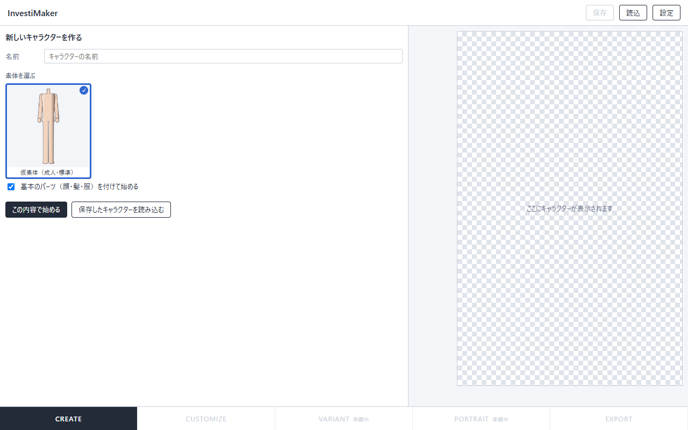

### CUSTOMIZE：髪を選ぶ

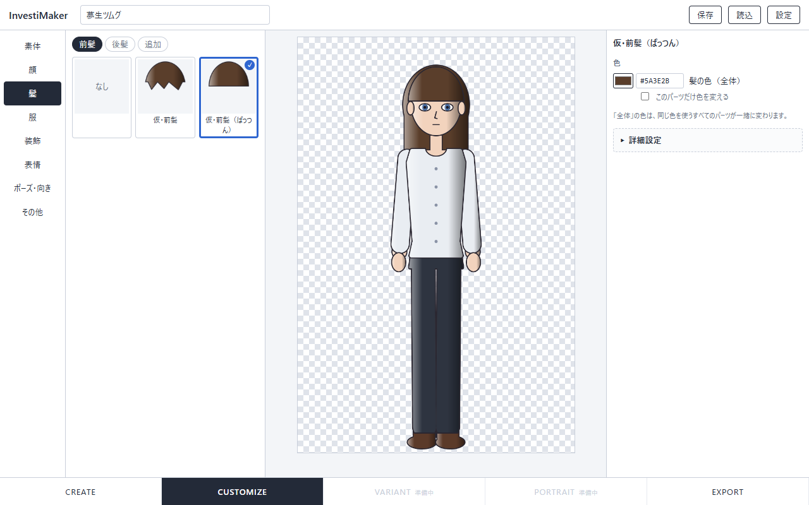

### CUSTOMIZE：服の色を変える

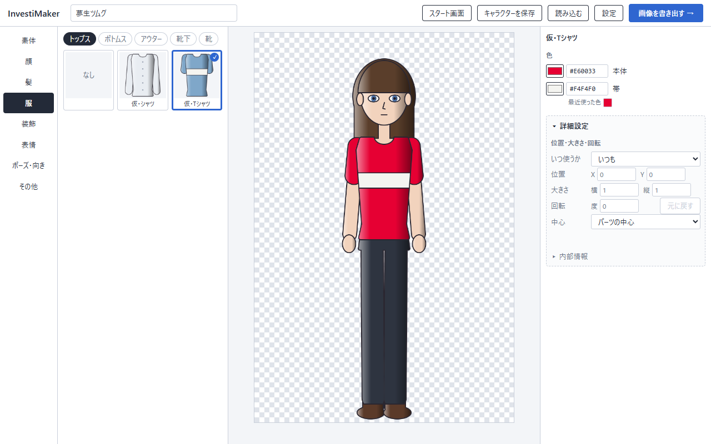

### CUSTOMIZE：素体（全体の色と体型）

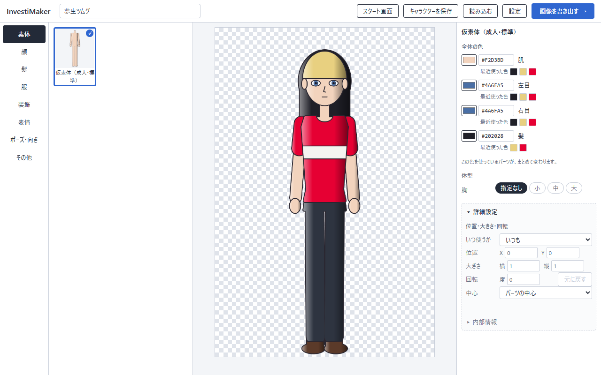

### CUSTOMIZE：表情

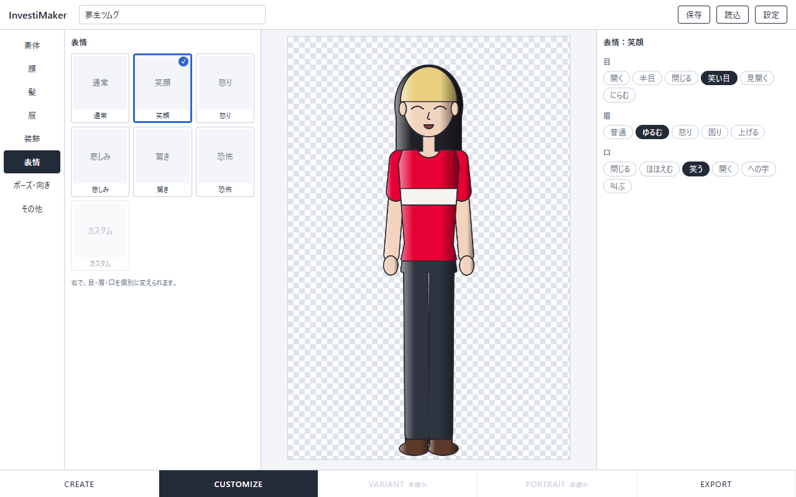

### CUSTOMIZE：ポーズ・向き（表示できなくなったパーツの注意）

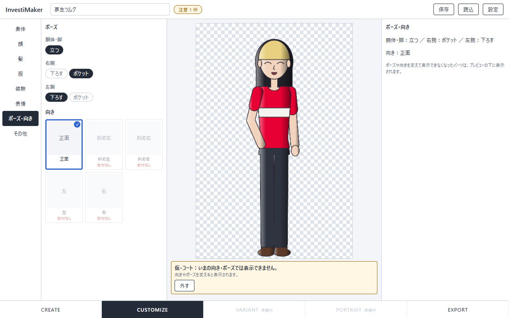

### CUSTOMIZE：選べないパーツ

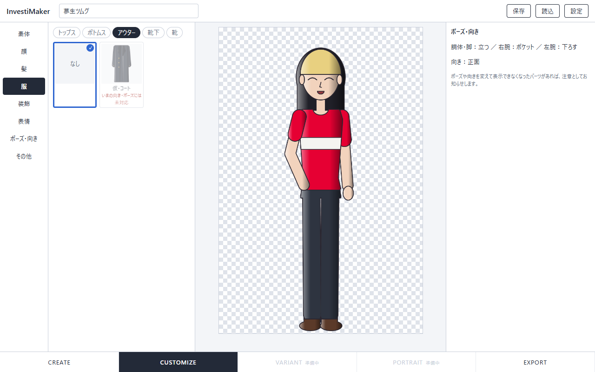

### CUSTOMIZE：詳細設定

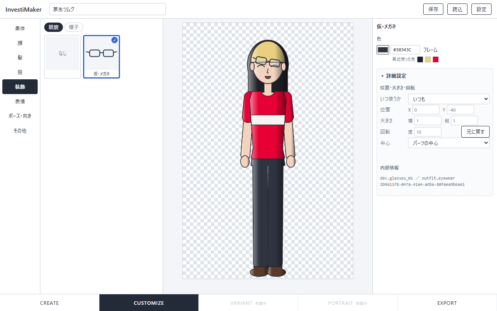

### EXPORT

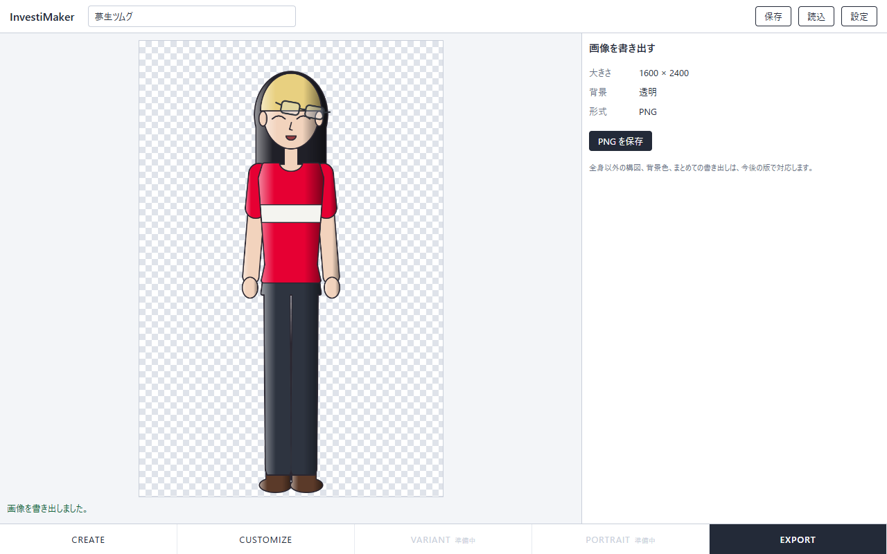

### 保存していない変更の確認

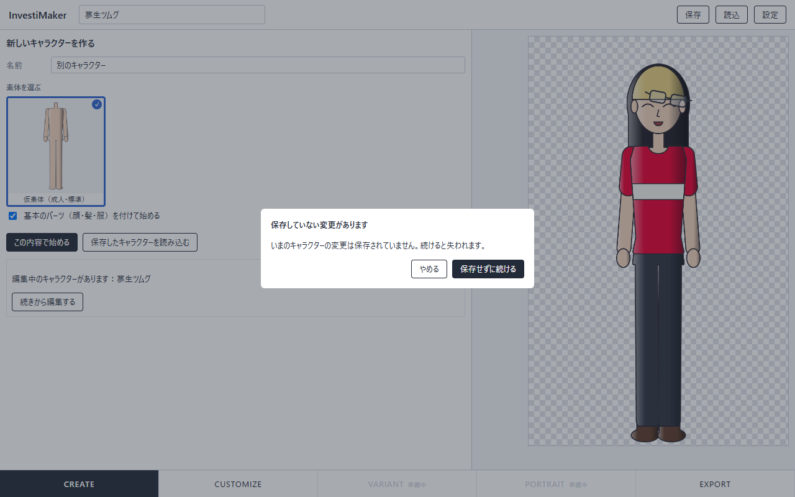

### 見つからない素材

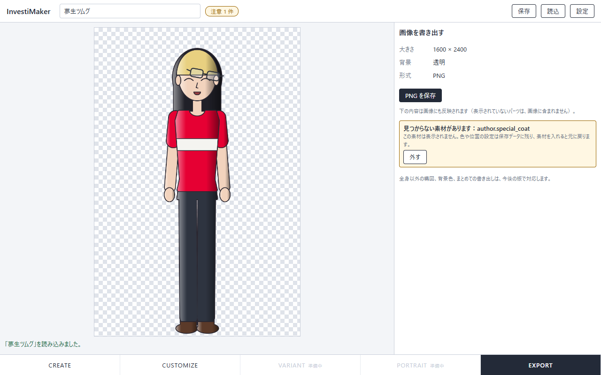

### 書き出せないとき（知らないポーズ）

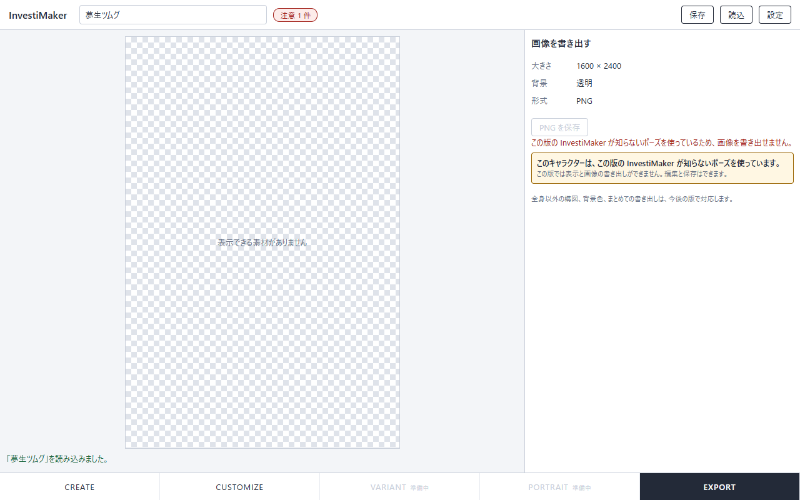

### 書き出せないとき（表示できる素材がない）

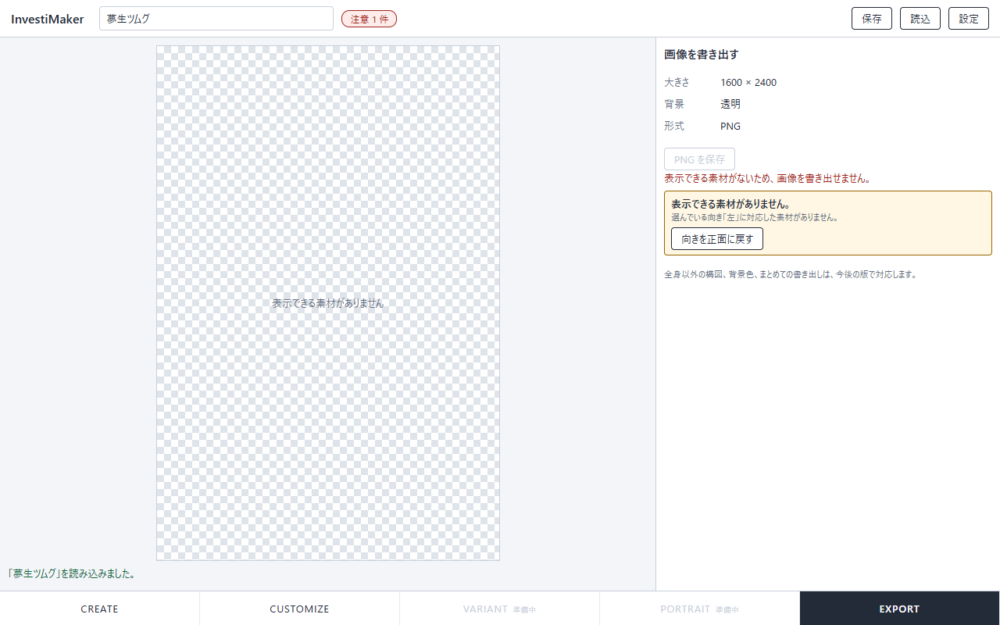

### 設定

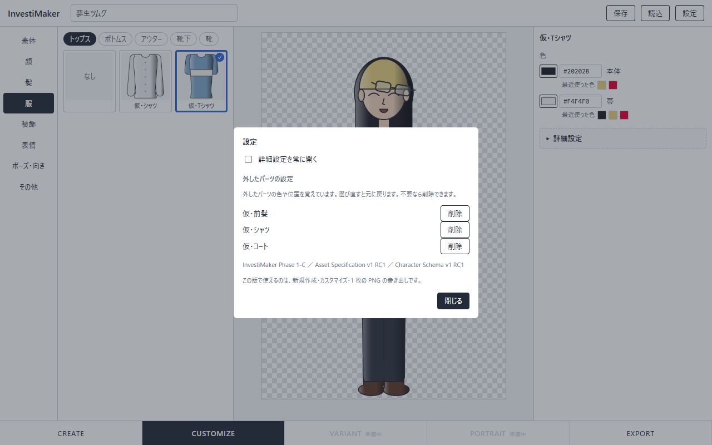

書き出した PNG は [images/creator_export.png](images/creator_export.png)、そのときの保存データは [data/creator-smoke-character.json](data/creator-smoke-character.json) にある。

## 3. 実際のブラウザでの確認

`tools/creator-smoke.ts` が、画面のボタン・カード・入力を操作し、JSON の読込はファイル選択として行う。期待と違えばその場で失敗する。

| 手順 | 確認したこと |
| --- | --- |
| CREATE | 最初は CREATE で、キャラクターはまだない。名前を入れて始めると CUSTOMIZE に移り、13 パーツを装備している。全体の色は素材の既定色で始まる。問題がなければ状態は何も出ない |
| 髪と服を選ぶ | 前髪の一覧に「なし」がある。別のカードを選ぶと入れ替わり、前のパーツの設定は残る。選んだパーツが右ペインの編集対象になる |
| 色 | 服の色が変わる。「このパーツだけ色を変える」に印を付けた瞬間は見た目が変わらない。その後、全体の髪色を変えても、切り離したパーツは追従しない |
| 表情 | プリセット「笑顔」で 3 つの状態が設定される。口だけ変えると「カスタム」になる |
| ポーズ・向き | 素材のない向き 4 つは選べず「素材なし」と出る。コートを着て右腕をポケットにすると注意が出る。コートは外れない。注意から外せる |
| 選べないパーツ | 右腕がポケットの間、コートのカードは選べず「いまの向き・ポーズには未対応」と出る。**一覧を行き来しても、キャラクターは変わらない** |
| 詳細設定 | 開くまで内部の ID は見えない。位置と回転が表示に反映される。中心は「パーツの中心」（メガネの位置）として保存される。条件つきの調整は、いまの調整の値から始まる。ポーズを変えると条件から外れ、戻すと元に戻る。「キャンバスの中心」では中心を保存しない |
| 保存していない変更 | 新しく始めようとすると確認が出る。「やめる」でそのまま。保存した後は確認なしで始められる |
| 保存 → 読込 → EXPORT | 読み込んだキャラクターが保存前と一致し、PNG も一致 |
| 見つからない素材 | 知らせる。書き出せる。再保存で、設定が位置・色ごと残る |
| 知らないポーズ | 知らせる。何も表示しない。書き出せない。値は保持する |
| 読み込めないファイル | 新しい版のファイル、壊れたファイルは読み込まず、理由を知らせる。いまのキャラクターはそのまま |
| 素材のない向き | 「表示できる素材がありません」と知らせ、書き出せない。「向きを正面に戻す」で直せる |
| 分類の重複 | 知らせる。両方装備したまま。パーツを選び直すと 1 つになる |

**内部の語の検査**：各段階で、画面に見えている文字（詳細設定の内部情報の欄を除く）に、`UNRESOLVED`・`INVALID`・`VALID`・`Instance`・`Layer`・`manifest`・`category`・UUID・`dev.…` の ID・`hair.front` のような category の ID が出ていないことを確かめている。例外は、見つからない素材の ID（判断 7）と、詳細設定の内部情報（判断 22）だけである。

## 4. 操作判断 1〜31 の反映

| # | 判断 | 反映 | 補足 |
| --- | --- | --- | --- |
| 1 | レイアウト案 B | ○ | 列の幅は伸び縮みする（決め打ちにしていない）。折り畳みは未実装（将来の要件） |
| 2 | 「なし」のカード | ○ | なくせない分類と、複数選べる分類には出さない |
| 3 | カードで装備と編集対象の選択を同時に | ○ | |
| 4 | 複数選べる分類は切り替え | ○ | 「複製」は置いていない（判断は「必要なら」） |
| 5 | 外したパーツの設定は通常の画面に出さない | ○ | 詳細設定の「外したパーツの設定」に一覧と削除 |
| 6 | 使えないパーツは選べなくし、理由を添える | ○ | 仮の Character と core の描画計画で判定（§5） |
| 7 | 見つからない素材は注意の一覧にまとめる | △ | **置き場所がワイヤーフレームと違う。** 左の一覧の下ではなく、プレビューの下の注意にまとめた（他の注意と同じ場所に 1 つにするため） |
| 8 | 全体の色を編集する場所 | ○ | 素体の右ペインと、リンク中のパーツの色の行 |
| 9 | 「このパーツだけ色を変える」 | ○ | core の `unlinkColor` / `relinkColor` を使う |
| 10 | 新規作成時に全体の色を入れておく | ○ | 装備順にたどって素材の既定色から作る（§5） |
| 11 | 色の選び方 | △ | 色選択と 16 進数の入力はある。**最近使った色は表示するだけ**で、押して選ぶことはできない |
| 12 | 表情のプリセット | ○ | |
| 13 | 外れたら「カスタム」 | ○ | `expressionPresetOf` で毎回求める |
| 14 | ポーズのプリセットは出さない | ○ | |
| 15 | 向きは「ポーズ・向き」の中 | ○ | |
| 16 | 素材のない向きは選べない | ○ | 読み込んだ向きはそのまま出し、直し方を示す |
| 17 | 状態の選択肢は名前のボタン | ○ | |
| 18 | 詳細設定の入口 | ○ | 開閉は、パーツを選び直しても保つ |
| 19 | 「いつ使うか」 | ○ | いつも ／ 右腕が〇〇のとき ／ いまの向きとポーズのとき |
| 20 | 条件つきの調整は写して始める | ○ | |
| 21 | 中心の既定は「パーツの中心」 | ○ | 「キャンバスの中心」「数値で指定」も選べる（§5） |
| 22 | 内部情報 | ○ | 詳細設定の中だけ |
| 23 | 装備順の並べ替えは置かない | ○ | |
| 24 | PNG 出力は EXPORT の段 | ○ | |
| 25 | VARIANT と PORTRAIT は「準備中」 | ○ | |
| 26 | CREATE を出す | ○ | |
| 27 | 保存していない変更の確認 | ○ | 画面内の確認（ブラウザ標準の確認ダイアログは使っていない） |
| 28 | 状態の見せ方 | ○ | 問題がなければ何も出さない。あれば名前の横に「注意 n 件」 |
| 29 | 読み込めないファイル | ○ | 細かい内容は、詳細設定を開いているときだけ添える |
| 30 | 書き出せないとき | ○ | 理由と、直せる場合は直し方 |
| 31 | 「設定」の中身 | △ | 「詳細設定を常に開く」と版の情報。**仕様書へのリンクは置いていない** |

## 5. 確定した 5 点の実装

1. **最小 UI を残す**：`src/minimal/` と `minimal.html`。`npm run smoke:minimal` が通る。Phase 1-B の証跡（画像と JSON）を上書きしないよう、スモークテストは `--write` を付けたときだけ書き出すようにした。
2. **なくせない分類**：`catalog.ts` の `REQUIRED_CATEGORIES`。「なし」のカードを出さず、注意の「外す」も出さない。
3. **カードが使えるかどうか**：`cardStates` が、候補ごとに `chooseCard` で仮の Character を作り、`evaluateCharacter` と `planCharacter` の結果からその Part の状態を見る。
   - **現在の Character には触れない。** core の操作はすべて新しいオブジェクトを返すので、元の Character は変わらない。テストで、全分類のカードの状態を求めた前後で Character が等しく、保存していない変更の判定も変わらないことを確かめた。ブラウザでも、一覧を行き来した前後で Character が一致する。
   - 最適化はしていない（一覧を描くたびに、表示中の分類の候補だけを評価する）。
4. **全体の色の初期値**：`initialSharedColors` が、`equipment` の並び順に Part をたどり、各 Part の ColorSlot を宣言の順に見て、共有色のキーごとに最初に見つかった既定色を採る。素材の読み込み順（Map の順）を逆にしても結果が同じことをテストしている。UI は色の値を持っていない。
5. **ここで止める**：1-C-3 には進んでいない。

**パーツの中心**（設計書 §20.2）：`partCenter` が、その Instance の描画対象の Layer について、画像ごとの「透明でない画素の範囲」と `offset` から外接矩形を求め、その中心を整数に丸める。画素を調べるのは `src/web/composer.ts` で、結果は画像ごとに覚えておく。テストでは、メガネだけを描いた画像の不透明な範囲の中心と一致することを確かめた。

- 調整を初めて作るときにだけ `pivot` を書く。すでに `pivot` を持つ調整の値は、ポーズが変わっても書き換えない。
- 「キャンバスの中心」は `pivot` を書かないことで表す。
- どの選び方に当たるかは、保存されている `pivot` とそのときのパーツの中心を比べて求める（UI は選び方を覚えない）。

## 6. UI が持つ状態

`src/app/main.ts` の `UiState` にまとめてある。どれも保存しない。

| 状態 | 指示書 §11 の一覧 | 用途 |
| --- | --- | --- |
| いまの段 | あり | CREATE / CUSTOMIZE / EXPORT |
| 開いている大分類、大分類ごとの小分類 | あり | 左の 2 列 |
| 編集対象（Instance、表情、ポーズ・向き） | あり | 右ペイン |
| 詳細設定の開閉 | あり | |
| 「いつ使うか」 | あり | 配置の調整 |
| 最後に保存・読込した時点の Character の写し（比較用の文字列） | あり（保存していない変更の有無） | 確認を出すかどうか |
| 最近使った色 | あり | |
| 表示中の通知 | あり | |
| **CREATE の入力中の値**（名前、素体、基本のパーツを付けるか） | **なし** | 「この内容で始める」を押すまで Character は存在しないので、入力中の値は UI が持つしかない。始めた時点で Character になり、UI 側の名前は消す |
| **「詳細設定を常に開く」** | **なし** | 「設定」の項目（判断 31）。画面の好みであって、キャラクターの内容ではない |

Character の写しを持っているのは「保存していない変更」の比較用の文字列だけで、表示や編集には使っていない。装備・色・状態・配置の調整は、すべて Character から毎回求めている。

## 7. 実装して使いにくかった点、変えた方がよいと考える点

画像（§2）と、操作を通して気づいたこと。1-C-3 で人が触って確かめたい。

1. **注意が出ると、プレビューが小さくなる。** 注意をプレビューの下に置いたので、その高さの分だけ絵が縮む（「ポーズ・向き」の画像）。注意が 2 件、3 件と増えるとさらに縮む。プレビューに重ねる、右ペインに出す、名前の横の印から開く、などの方が絵を守れる。
2. **絵のないカードで、名前が 2 回出る。** 表情と向きのカードはサムネイルがないので、絵の位置と名前の位置に同じ文字が出ている。名前だけのボタンにするか、判断 17 で見送ったサムネイル（顔の部分を小さく描く）を作るか。
3. **素材が少ないと、一覧の列がほとんど空く。** いまは 1 分類に 1〜2 個なので、「選ぶ」列の大半が余白になる。素材が増えれば埋まるが、現状ではプレビューを広くした方が使いやすく見える。
4. **右ペインの詳細設定が詰まっている。** 位置・大きさ・回転・中心・内部情報・外したパーツの設定が縦に並び、1280×800 で収まりきらずスクロールが出る。「外したパーツの設定」は選択中のパーツと関係がないので、「設定」の中など別の場所の方がよいかもしれない。
5. **どのパーツを編集しているかが、右ペインの見出しでしか分からない。** プレビュー上で選択中のパーツを示す手がかりがない。別の分類を開くと、一覧に選択中のカードが見えなくなる。
6. **全体の色を、パーツの行から変えられることに気づきにくい。** 髪を選んで色を変えると全体の髪色が変わる。名前に「（全体）」と付け、説明も出しているが、変えた瞬間に他のパーツが変わることで初めて分かる。
7. **名前の長いパーツは、カードの中で折り返す。**（「仮・前髪（ぱっつん）」）
8. **CREATE で素体だけを選んでも、プレビューには何も出ない。** 始めるまで Character がないため。素体を選んだ時点で絵を見せる方が自然かもしれない（その場合は UI が仮の Character を持つことになる）。
9. **「元に戻す」が、条件つきの調整では「その条件の調整を消す」を意味する。** いつもの調整に戻るので結果は合っているが、言葉が曖昧。
10. **表情の「カスタム」のカードは押せない。** 状態を示すだけなので、カードの形でない方が誤解がない。

## 8. 仕様への気づき

仕様書は書き換えていない。意味論に関わるもので、独断で確定せず保留にしたものを先に挙げる。

### 保留にしたもの

| 項目 | 保留にした理由 |
| --- | --- |
| **素体の入れ替え** | 素体を別のものに替えたとき、いまのパーツ（その素体に対応していないもの）、`fit` の値、配置の調整をどうするかは、Character Schema にも Asset 仕様にも規定がない。「外す」「残して非対応にする」「確認して選ばせる」のどれも成立し、保存データの内容に関わる。**実装していない**（素体は 1 種類なので、CREATE でも CUSTOMIZE でも選択肢は 1 つ。他の素体のカードは選べない状態で出る作りにしてある） |
| **同じパーツの複製**（判断 4 の「必要なら」） | 複数選べる分類で同じ Part を 2 つ持つ操作。Character Schema は表現できるが、通常の一覧での切り替え（付ける／外す）と、複製した Instance のどれを外すかの関係を決める必要がある。置いていない |

### 一意に解釈して実装したもの

| 項目 | 解釈 |
| --- | --- |
| 条件つきの調整を作るときの `pivot` | いまの調整を写すので、`pivot` も写す（Character Schema §5.5 の「基本の値を写して始める」に含まれる）。写す元に `pivot` がなければ、パーツの中心を書く |
| パーツの中心を求める座標系 | 配置の調整を適用する**前**の位置で求める。`pivot` はキャンバスの座標で、補正の入力だからである（Asset 仕様 §9） |
| 複数選べる分類で、同じ Part の Instance が複数装備されている場合の「外す」 | そのカードを押すと、その Part の装備中の Instance をすべて外す（外部で編集された JSON でだけ起こる） |
| 全体の色の一覧に出すキー | 設定済みの共有色と、装備中のパーツが参照している共有色。後から装備したパーツが新しいキーを参照していれば一覧に出て、編集すると設定される（未設定の間は Asset 仕様 §5.4 のとおり Part の既定色） |

### 気づき

- **表示名を持たない値は、そのまま出る。** 素材や保存データが、辞書にない状態名・ポーズ・共有色のキーを持っていると、`crossed` のような内部の値が画面に出る。隠すよりは出す方がよいという判断だが、素材側が表示名を持てる仕組みがないと、ユーザー素材の独自の値は常に内部名で出ることになる（Asset 仕様の対象ではないという決定の、帰結として記録する）。
- **Part の `name` とスロットの `name` は、そのまま画面に出る。** 仮素材は「仮・コート」のような名前なので問題ないが、manifest の `name` が利用者向けの名前であることが前提になる。
- **書き出した PNG には、不足があったことが残らない**（Phase 1-B から変わらず）。

## 9. Phase 1-C-3 で人が操作して確かめるべき点

1. §7 の 10 点。特に、注意でプレビューが縮むこと（1）と、編集中のパーツが分かりにくいこと（5）。
2. 初めて触る人が、説明なしで「髪を変える → 色を変える → 保存する → 画像を出す」までたどり着けるか。
3. 「全体の色」と「このパーツだけ色を変える」の関係が、言葉だけで伝わるか。
4. 「ポーズ・向き」に向きがあることに気づくか。素材のない向きの「素材なし」が、邪魔に見えないか。
5. 詳細設定の「いつ使うか」と「中心」の意味が、説明なしで分かるか。数値の入力だけで、位置合わせができるか。
6. 使えないパーツの理由（「いまの向き・ポーズには未対応」「『トップス』が必要」）で、何をすれば使えるかが分かるか。
7. 1280×800 より狭い画面、広い画面での見え方（列の幅は伸び縮みするが、折り畳みはない）。
8. PNG 出力が EXPORT の段にあることに、すぐ気づくか。
9. カードの大きさ、プレビューの大きさ、右ペインの密度（§2 の画像）。

## 10. 今回足さなかったもの

指示書 §14 のとおり。作りたくなったが足さなかったもの：

- 最近使った色を押して選ぶ操作（表示だけにした）
- 状態のサムネイル
- プレビュー上での選択中のパーツの強調
- Part の一覧の折り畳み
- 素体を選んだ時点でのプレビュー

## 11. 再現手順

```sh
npm install
npm test                         # 336 件
npm run smoke:creator            # Creator UI をヘッドレスの Chrome / Edge で操作する
npm run smoke:creator -- --write # 加えて、画面の画像と結果を docs/reports/ に書き出す
npm run smoke:minimal            # Phase 1-B の最小 UI
npm run dev                      # http://127.0.0.1:5173/ が Creator UI、/minimal.html と /lab.html が検証用
```

## 12. 判定記録（2026-10-05）

**Phase 1-C-2 は完了と判定された。** `phase1c-creator-ui` は main へマージせず保持し、Phase 1-C-3（操作検証）を終えてから Phase 1-C 全体を閉じる。

| 項目 | 判定 |
| --- | --- |
| レイアウト案 B | 変えない。残る問題は構造ではなく、通知・詳細設定・絵のないカードなど、各領域の内側の磨き込み |
| 注意でプレビューが縮むこと（§7 の 1） | **最優先。** 中央のプレビューの大きさは、通知によって変化させない。置き場所は 1-C-3 で実際に比べて決める |
| 詳細設定の密度（§7 の 4） | 「外したパーツの設定」は詳細設定から外す方向。選択中のパーツの設定ではなく、キャラクター全体のデータの管理だからである |
| 絵のないカード（§7 の 2） | **サムネイルがあれば画像と名前、なければ名前だけにする。** 判定を受けて直した（§2 の表情とポーズ・向きの画像は、直した後のもの）。状態のサムネイルを作れるようになったら、画像つきのカードへ戻せる |
| 判断 7（通知の位置） | 問題なし。プレビューを圧迫するという知見が得られた |
| 判断 11（最近使った色） | 1-C-3 で、押して選べるようにする候補 |
| 判断 31（仕様書へのリンク） | 不要。開発者向けの情報を整える段階まで保留 |
| 追加した UI の状態 2 つ（§6） | 正式に許容する。どちらも Character の正本性を侵していない |
| 素体の入れ替え（§8） | 保留を続ける。複数の素体を入れる前に、何を維持するかを別途設計する |

Phase 1-C-3 の優先順位：初見で一通りできるか → プレビューの大きさが安定しているか → 編集中のパーツが分かるか → 全体の色と個別の色 → ポーズ・向きと「素材なし」 → 詳細設定 → 使えないパーツの理由 → 画面の幅 → 導線と密度。

1-C-3 では、テストを通すことより、迷った箇所を記録することを重視する。

## 13. 追記：ページの構成と配り方（Phase 1-C-3 の準備中の変更）

本書の作成後、利用者への配り方について次の要件が示された。

> ZIP をダウンロードして解凍し、index.html を開くだけ。ページは実際に切り替わる。GitHub Pages でも動く。

これに合わせて、Creator UI を「1 つのページの中での切り替え」から、**3 つのページ**に改めた。画面の内容と操作は本書のとおりで、変わったのは、段の切り替えがページの移動になったことである。

| ファイル | 段 | 内容 |
| --- | --- | --- |
| `index.html` | CREATE | 最初のページ。名前と素体を決めて始める、保存したキャラクターを読み込む |
| `customize.html` | CUSTOMIZE | 作成画面 |
| `export.html` | EXPORT | 画像の書き出し |
| `app/` | — | 3 ページが使うプログラム・見た目の定義・素材 |

- この 3 ページと `app/` は生成物で、`npm run build:site` が作る。開発用のページは `dev/` に置いた（最小 UI と検証ページもそこへ移した）。
- **ファイルを直接開いても動く。** ブラウザは、直接開いたファイルからのモジュールの読み込み・fetch・画像の画素の読み取りを制限する。そのため、スクリプトはモジュールではない形にまとめ、素材は `app/assets.js` に埋め込んである。
- **編集中の Character は、セッションストレージでページ間を運ぶ**（`src/app/store.ts`）。正本は Character 1 個のままで、変更のたびに保存 JSON の形で書き、ページを開いたときに保存ファイルと同じ検証を通して読み直す。タブを閉じると消える。副次的に、ページを再読み込みしても編集中の内容が残る。
- §6 の「UI が持つ状態」のうち、開いている分類・編集対象・詳細設定の開閉・最近使った色・「詳細設定を常に開く」も、移った先で続きから操作できるよう、同じ場所で運ぶ。
- 最初のページに戻ったとき、編集中のキャラクターがあれば「続きから編集する」を出す。
- 本書 §11 の手順で `http://127.0.0.1:5173/` としている箇所は、`/dev/` に読み替える。

確認したこと：

- `npm run build:site` が、生成物だけを別のフォルダへ写し、`index.html` をファイルとして開いて、`customize.html`・`export.html` へ移り、表示と PNG の書き出しができることを確かめる。
- `npm run smoke:creator` が、開発用のページで同じ 3 ページの流れを通す（ページを移っても編集中のキャラクターが変わらないこと、最初のページから読み込むと作成画面へ移ることを含む）。

未確認：GitHub Pages に実際に置いた状態では試していない（相対パスだけで動く作りなので動く見込みだが、公開して確かめる必要がある）。Chrome 以外のブラウザでも試していない。

設計書（`InvestiMaker_Phase1C_UIUX_Design.md`）の §20.5 にも、この決定を追記した。
