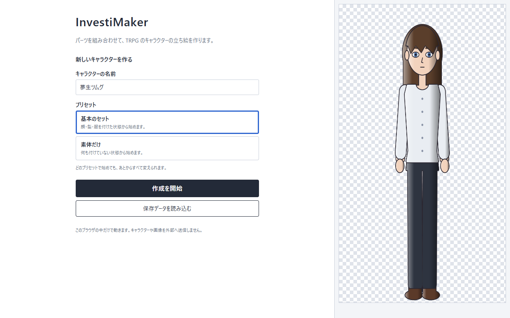

# Phase 1-C-D 検証レポート（Distribution Foundation：配布の土台）

2026-10-05 ／ 対象：基本設計書 v1.0 §20.1「Phase 1-C-D でやること」

## 1. 結論

- **配布物は 1 種類になった。** `index.html`・`customize.html`・`export.html`・`app/` の 4 つで、ZIP を解凍して `index.html` を開く場合と、Web サーバーに置く場合の両方で、同じファイルが動く。
- **`index.html` をスタート画面にした。** 名前とプリセットを決めて「作成を開始」を押すと、ページが移って作成画面になる。
- **配布物の検証を自動で行えるようにした**（`npm run smoke:dist`）。39 項目がすべて通った。Chrome 154 と Edge 154 で確かめた。
- Creator UI の意味（Character の扱い、保存形式）と、2 つの RC1 仕様は変えていない。
- 人の手での確認と、GitHub Pages に実際に置いた確認は、まだである（§6）。

## 2. 基本設計書 v1.0 §20.1 との対応

| やること | 結果 |
| --- | --- |
| 現在の `standalone` 方式を調査し、正式配布構造へ統合する | 済。`standalone/` は前回の作業で廃止済み。配布物を組み立てる処理を `tools/distribution.ts` の 1 か所にまとめた |
| 本番成果物を `file://` と静的 HTTP の両方で動かす | 済。§4 |
| GitHub Pages 用成果物とローカル ZIP 用成果物を同一化する | 済。同じ ZIP を解凍したものを、両方の検証に使っている |
| Distribution Smoke Test を追加する | 済。`npm run smoke:dist` |
| Offline Test を追加する | 済。ただし「通信できない状態のブラウザ」での確認である（§4.3、§6） |
| 開発用 `minimal` / `lab` を本番成果物から分離する | 済。開発用のページは `dev/` にあり、配布物には入らない。検証が、配布物のファイルの一覧を確かめる |
| 既存 Creator UI の意味論は変更しない | 変えていない（§3.3） |

## 3. 変えたこと

### 3.1 スタート画面（`index.html`）

- 置いたもの：キャラクターの名前、プリセット、「作成を開始」、「保存データを読み込む」。右側に、選んでいるセットの見た目を出す。
- ヘッダー（保存・読込・設定）と下の段の帯は、スタート画面には出さない。
- 編集中のキャラクターがあるときは、「続きから編集する」を上に出す。
- 名前の欄で Enter を押しても、作成を開始できる。
- 読み込めないファイルを選んだときの知らせは、ボタンの下に出す。

### 3.2 プリセット

- プリセットは、最初に装備するパーツの組である。**Character には保存しない**（保存されるのは、その結果として装備されたパーツだけ）。テストで確かめている。
- いま選べるのは「基本のセット」（顔・髪・服を付けた状態）と「素体だけ」の 2 つ。これまでのチェックボックス「基本のパーツを付けて始める」を、選ぶ形に置き換えたもので、作られる Character は以前と同じである。
- 仮素材には素体が 1 つしかないので、素体の選択は出していない。素体が増えたら、セットは素体ごとに並ぶ。

### 3.3 変えていないこと

- 編集・評価・描画計画・保存・読込の処理（`src/core/`、`src/app/session.ts` の既存の関数）。
- 作成画面（`customize.html`）と書き出し画面（`export.html`）の内容と操作。
- 通知の置き場所の比較（`?notices=`）。Phase 1-C-3 で決める。

### 3.4 配布物を作る仕組み

| ファイル | 役割 |
| --- | --- |
| `tools/distribution.ts` | ソースから配布物を組み立てる（ファイルは書かない） |
| `tools/build-site.ts` | 組み立てたものを、リポジトリのルートへ書く（`npm run build:site`） |
| `tools/dist-smoke.ts` | 配布物の検証（`npm run smoke:dist`） |
| `tools/zip.ts` | ZIP を作る・読む。依存を増やさないよう、Node 標準の zlib で書いた |

配布物を利用者が手に入れる道は 2 つあり、どちらもルートに `index.html` がある（基本設計書 §17）。

- リポジトリの ZIP（GitHub の「Download ZIP」）。リポジトリのルートが配布物を兼ねる。ソースや文書も一緒に入る。
- `release/InvestiMaker.zip`。配布物の 6 ファイルだけが入る（611 KB）。検証のたびに作られ、git では管理しない。

## 4. 検証

`npm run smoke:dist` が、次を順に行う。途中で期待と違えば、その場で失敗する。結果は `data/distribution-smoke.json` にある。

### 4.1 配布物そのもの

- ソースから組み立てた配布物が、リポジトリのルートに置いてあるものと同じ。
- 配布物は 6 ファイルだけ（開発用のページを含まない）。
- 3 つのページが読み込むのは `app/` の中のファイルだけ。スタイルも外部のファイルを読み込まない。
- ZIP のルートに `index.html` がある。Windows 付属の tar で 2 つのフォルダへ解凍し、中身が配布物と同じ。

### 4.2 同じ操作を、ローカルと Web の両方で

| | ローカル | Web |
| --- | --- | --- |
| 開き方 | 解凍したフォルダの `index.html` を `file://` で開く | 解凍したフォルダを静的な HTTP サーバーで配り、`/InvestiMaker/` を開く（GitHub Pages と同じく、サブフォルダの下） |
| ブラウザの状態 | 通信できない | 通常 |

操作は、画面の要素に対して行う（ボタンを押す、名前を入れる、ファイルを選ぶ）。

1. スタート画面が出る（ヘッダーと下の帯がない、キャラクターはまだない、プリセットを選べる、見た目が出る）
2. 名前を入れ、基本のセットを選び、「作成を開始」→ 作成画面へ移る（装備 13）
3. 髪を変える
4. 保存する（Character JSON）
5. スタート画面へ戻る →「続きから編集する」が出ている →「素体だけ」で別のキャラクターを作る
6. スタート画面へ戻り、「保存データを読み込む」で 4 の JSON を読み込む → 作成画面へ移る
7. 保存し直した JSON が、4 の JSON と 1 バイトも違わない
8. 書き出し画面へ移り、1600×2400 の PNG を書き出す

### 4.3 オフライン

ローカルの確認に使うブラウザは、すべての通信を存在しない中継先へ向けて起動している。この状態で、通常のブラウザなら届く相手（検証用の HTTP サーバー）に届かないことを、先に確かめている。

- その状態で、4.2 の操作がすべて通る。
- 操作中にページが読み込もうとした URL を全部記録した（388 件）。解凍したフォルダの外への読み込みは **0 件**。
- Web の側も同じく 388 件で、配布物を置いたサーバー以外への通信は 0 件。

### 4.4 ローカルと Web の結果の比較

| 比べたもの | 結果 |
| --- | --- |
| 同じ操作で作った Character JSON | 同じ（作るたびに変わる ID を、出てきた順の番号に置き換えて比較） |
| 同じ操作で作った PNG | 1 バイトも違わない |
| 同じ Character（ローカルで保存した JSON）を両方で読み込み、保存し直した JSON | 1 バイトも違わない |
| 同じ Character から書き出した PNG | 1 バイトも違わない |

### 4.5 ほかのテスト

| | 結果 |
| --- | --- |
| `npm test` | 338 件すべて通過（プリセットの 2 件を追加） |
| `npm run typecheck` | 通過 |
| `npm run smoke:creator`（開発用のページで Creator UI を通す） | 通過 |
| `npm run smoke:minimal` | 通過 |
| `npm run build` | 通過 |
| `npm run smoke:dist` を Edge 154 で | 39 項目すべて通過 |

## 5. Phase 1-C の完了条件（基本設計書 §12.1）の現在地

| # | 条件 | 状態 |
| --- | --- | --- |
| 1 | Creator UI の基本操作が人による操作検証を通る | 未（Phase 1-C-3） |
| 2 | 通知等の主要 UX 問題が解消される | 未（Phase 1-C-3。通知の置き場所を決める） |
| 3 | 本番成果物を GitHub Pages 相当の HTTP 環境で起動できる | 自動の検証は通過。実際の GitHub Pages では未確認 |
| 4 | 同じ成果物を ZIP 化・別フォルダへ解凍し、ルートの `index.html` をダブルクリックして起動できる | 自動の検証は通過（`file://` で開く）。人がダブルクリックする確認は未 |
| 5 | ローカル直接起動で CREATE → CUSTOMIZE → JSON 保存 → JSON 読込 → PNG 出力が完了する | 通過 |
| 6 | Web 起動でも同じ操作が完了する | 通過 |
| 7 | Web / ローカルで同一 Character から生成した保存データと PNG が意味的に一致する | 通過（バイト単位で一致） |
| 8 | ローカル版の基本機能がオフラインで動作する | 通信できない状態のブラウザで通過。回線を切った PC での確認は未 |
| 9 | 利用者に npm、サーバー、インストールを要求しない | 満たしている |
| 10 | Asset Specification / Character Schema RC1 の意味論を破壊しない | 変えていない |

## 6. 確かめていないこと

- **人の手での確認。** ZIP をエクスプローラーで解凍し、`index.html` をダブルクリックして使う、という利用者と同じ手順は、まだ誰も行っていない。検証は Windows 付属の tar で解凍し、ヘッドレスのブラウザに `file://` の URL を渡している。
- **回線を切った PC での確認。** 4.3 は、ブラウザを通信できない状態にしたもので、PC の回線は切っていない。
- **実際の GitHub Pages。** 公開していないので、置いた状態では試していない。
- **Chrome・Edge 以外のブラウザ**（Firefox、Safari）と、スマートフォン。
- **ファイルのダウンロードそのもの。** 保存と書き出しは、保存される内容（JSON と PNG）を確かめている。ブラウザがファイルをダウンロードフォルダへ書くところは、ヘッドレスでは確かめていない。

## 7. 判断をお願いしたいこと

実装にあたって、設計書から一つに決まらなかった点を、次のように置いた。どれも後から変えられる。

1. **スタート画面が CREATE の段を兼ねる。** 基本設計書 §7 の CREATE（名前と素体を選び、Character を作る）を、スタート画面で行う。作成画面の下の帯の「CREATE」は、スタート画面へ戻るボタンになっている。スタート画面と CREATE を別のページに分ける形にはしていない。
2. **プリセットは「基本のセット」「素体だけ」の 2 つ。** 「標準 A」「標準 B」「子ども体型」のようなセットは、対応する素体と素材がないので作っていない。
3. **配布物はリポジトリのルートに置いたまま。** 以前のご判断（リポジトリの ZIP で動くこと）のとおり。加えて、配布物だけの ZIP（`release/InvestiMaker.zip`）も作れるようにした。GitHub の Release に添付するかどうかは、公開の段階で決められる。
4. **ページは `index.html`・`customize.html`・`export.html` の平置き。** `creator/` のようなサブフォルダには分けていない。

## 8. 次の作業

Phase 1-C-3（操作検証）を、この配布物で行う。`release/InvestiMaker.zip` を解凍して `index.html` を開くところから始めれば、§6 の「人の手での確認」も同時に済む。
